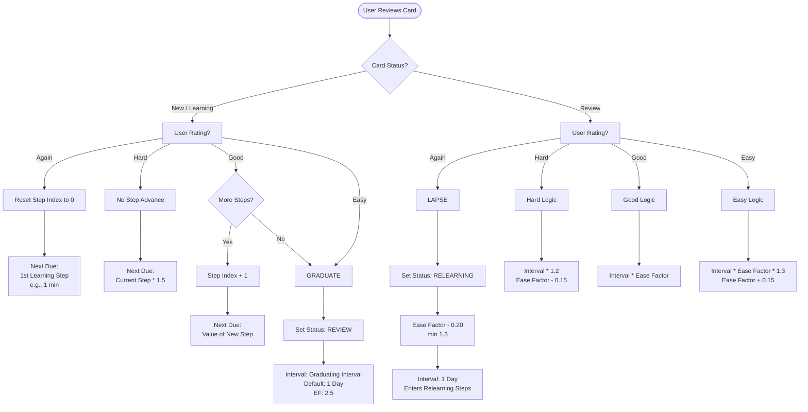

# **Frontend Guide: Flashcard Events & State**

## **1\. User Interaction Flow**

The frontend is responsible for displaying the card, capturing the user's rating, and optimistically updating the UI or handling the API response.

The following flowchart illustrates the decision tree the user moves through. Use this to understand why a card might seemingly "reset" or jump dates.



## **2\. Event Handling & Button Logic**

### **The 4 Buttons**

The UI must display 4 buttons. It is "Best Practice" to show the **estimated next interval** on the button itself (e.g., "Good (10m)" or "Easy (4d)").

**Button Mapping:**

1. **Again (Fail):** Used when the user does not know the answer.
2. **Hard:** Used when the user struggled significantly.
3. **Good:** The default button. Used when the answer was recalled with reasonable effort.
4. **Easy:** Used when the answer was instant; boosts the interval aggressively.

### **Displaying "Next Due" Projections**

To display the labels (e.g., "10m", "4d"), the frontend should request these projections from the backend **when the card is loaded**, OR calculate them locally if using a shared library.

**Example UI State:**

```json
{
  "currentCard": {
    "id": "123",
    "front": "Hello",
    "back": "Hola",
    "status": "learning"
  },
  "projectedIntervals": {
    "again": "1 min",
    "hard": "6 min",
    "good": "10 min",
    "easy": "4 days"
  }
}
```

### **Event Handler (Pseudocode)**

```javascript
async function handleRating(rating) {
  // 1. Optimistic Update (Optional)
  // Hide current card, show loading or next card immediately

  // 2. API Call
  try {
    const response = await api.post(`/cards/${currentCard.id}/review`, {
      rating,
    });

    // 3. Confirm Update
    // If backend returns the updated card, sync state.
  } catch (error) {
    // Revert UI if failure
    showError("Failed to save review");
  }
}
```

## **3\. Formatting Time Intervals**

When displaying due_date or interval to the user:

- **\< 1 minute:** "Now"
- **\< 60 minutes:** "Xm" (e.g., 10m)
- **\< 24 hours:** "Xh" (e.g., 4h)
- **\>= 1 day:** "Xd" (e.g., 3d)
- **\> 30 days:** "Xmo" (e.g., 1.2mo)
- **\> 365 days:** "Xy" (e.g., 1.5y)
